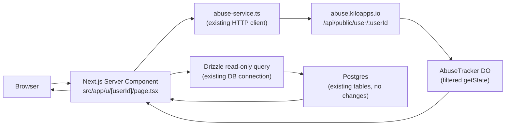

# RFC: Public Usage Profile — Zero Database Changes Proposal

| Field   | Value                          |
| ------- | ------------------------------ |
| Date    | 2026-03-06                     |
| Status  | Draft                          |
| Author  | Kilo Bot, on behalf of Brendan |

---

## Problem Statement

Users want to showcase their Kilo usage publicly — think GitHub profile or Chess.com profile — displaying stats like total requests, model distribution, activity streaks, and tenure. A public usage profile would strengthen community engagement and give power users a shareable artifact that demonstrates their adoption of Kilo features.

The original proposal required new database tables, new columns, and additional writes inside `insertUsageAndMetadataWithBalanceUpdate` (the hot write path that atomically inserts into `microdollar_usage`, `microdollar_usage_metadata`, 11 lookup tables, and updates `kilocode_users.microdollars_used`). Modifying that path carries risk: it is the most latency-sensitive transaction in the system and any regression directly impacts every billable request.

**This RFC explores alternatives that require zero database schema changes and zero modifications to any write path.**

---

## Architecture Constraints

1. **No new DB tables or columns.** The Postgres schema must remain unchanged.
2. **No changes to `insertUsageAndMetadataWithBalanceUpdate`** or any other write path in `src/lib/processUsage.ts`.
3. **Privacy-safe.** Profile data must be opt-in, must not leak PII, and must never expose abuse signals or verdicts.
4. **Performant.** Must not add meaningful load to the primary Postgres database. Caching and read replicas are acceptable.

---

## Existing Infrastructure Summary

### Abuse Worker (abuse repo)

- Cloudflare Worker deployed at `abuse.kiloapps.io`.
- Contains the `AbuseTracker` Durable Object (DO) with SQLite storage, keyed by identity string (e.g., `user:{kilo_user_id}`).
- DO tables: `identity_metadata` (first_seen, is_known_abuser, total_request_count) and `requests` (timestamp, cost, requested_model, verdict, risk_score, signals, ip_address, geo_city, geo_country, user_agent).
- Exposes `getState()` RPC returning: `{ first_seen, recent_requests, model_counts, total_request_count, is_known_abuser }`.
- Writes to two Analytics Engine datasets: `ABUSE_ANALYTICS` (kilo_abuse_events) and `USAGE_COSTS_ANALYTICS` (kilo_usage_costs).
- Auth: CF Access service tokens + `SERVICE_AUTH_SECRET` for service-to-service calls.

### Cloud Repo (Next.js on Vercel)

- Talks to abuse via `src/lib/abuse-service.ts` using CF Access service tokens.
- Hot write path: `insertUsageAndMetadataWithBalanceUpdate` in `src/lib/processUsage.ts`.
- Existing DB tables with useful data: `kilocode_users` (id, google_user_name, google_user_image_url, linkedin_url, github_url, microdollars_used, total_microdollars_acquired, cohorts), `microdollar_usage` (cost, tokens, model), `microdollar_usage_metadata` (editor, feature, mode).
- Public pages exist outside the `(app)/` route group (e.g., `share/[shareId]/`, `s/[sessionId]/`).
- Only existing public API: `src/app/api/public/oss-sponsors/`.
- Users do NOT have usernames/slugs — only `google_user_name` and opaque user IDs.
- Multiple Cloudflare Workers live in the repo: `cloud-agent-next/`, `cloudflare-session-ingest/`, `kiloclaw/`, etc.

---

## Proposed Options

### Option A: Abuse Service HTTP API (Minimal Change)

Add a new authenticated endpoint to the existing abuse worker that returns a filtered, privacy-safe subset of `getState()` data. The cloud repo's Next.js app calls this endpoint from a new public profile page.

**New abuse worker endpoint:**

```
GET /api/public/user/:userId
```

```jsonc
// Response (filtered — no abuse signals, no PII)
{
  "total_request_count": 14832,
  "first_seen": "2025-06-15T08:22:00Z",
  "model_counts": {
    "claude-sonnet-4-20250514": 8201,
    "gpt-4o": 3102,
    "gemini-2.5-pro": 3529
  }
}
```

**Data flow:**

```
Browser → Next.js server component → abuse-service.ts HTTP → abuse worker → AbuseTracker DO → filtered response
```

**Pros:**
- Minimal code changes — a single new endpoint in the abuse worker, a single new page in the cloud repo.
- Reuses the existing `abuse-service.ts` HTTP connection pattern.
- No new infrastructure to deploy.

**Cons:**
- Limited data — only what the AbuseTracker DO currently tracks (no token counts, no editor/feature breakdown).
- Adds latency: Vercel → Cloudflare Worker → Durable Object round-trip.
- The abuse worker was not designed for public-facing traffic patterns; a viral profile could generate unexpected load on the DO.

---

### Option B: New Cloudflare Worker with Abuse Worker Service Binding

Create a new Cloudflare Worker in the cloud repo (e.g., `cloudflare-public-profile/`) that uses a [service binding](https://developers.cloudflare.com/workers/runtime-apis/bindings/service-bindings/) to the abuse worker. This worker exposes a public API, fetches from the AbuseTracker DO via the service binding, and returns a curated profile response.

**Deployment:**

```
profile.kiloapps.io/api/user/:userId
```

**Data flow:**

```
Browser → profile.kiloapps.io worker → service binding → abuse worker → AbuseTracker DO → filtered response
```

The worker can maintain its own caching layer (CF Cache API or Workers KV) to avoid hitting the DO on every request.

**Pros:**
- Dedicated service with a clear boundary — public profile concerns don't leak into the abuse worker.
- Can add KV or Cache API caching with configurable TTLs.
- Clean path to enrich with additional data sources later.
- Follows the existing pattern of per-concern workers in this repo.

**Cons:**
- New infrastructure to deploy and maintain (wrangler config, CI, DNS).
- Still limited to abuse DO data unless enriched.
- Service binding requires both workers in the same CF account (which they are).

---

### Option C: New Cloudflare Worker with Direct AbuseTracker DO Binding

Instead of a service binding to the abuse *worker*, the new worker directly binds to the `AbuseTracker` Durable Object class via `script_name` in the wrangler config. This skips the abuse worker's HTTP/tRPC layer entirely and calls `stub.getState()` via RPC.

**Wrangler config sketch:**

```jsonc
// cloudflare-public-profile/wrangler.jsonc
{
  "durable_objects": {
    "bindings": [
      {
        "name": "ABUSE_TRACKER",
        "class_name": "AbuseTracker",
        "script_name": "kilo-abuse"  // the abuse worker's script name
      }
    ]
  }
}
```

**Data flow:**

```
Browser → profile.kiloapps.io worker → AbuseTracker DO (direct RPC) → filtered response
```

**Pros:**
- Fastest path to DO data — no HTTP overhead, direct RPC to the DO stub.
- Can build custom aggregation logic in the worker.
- Can combine with its own DO or KV for caching/enrichment.

**Cons:**
- Tighter coupling to AbuseTracker internals — changes to the DO's RPC interface break this worker.
- Cross-worker DO binding requires the same CF account (satisfied here, but limits future flexibility).
- Bypasses the abuse worker's auth and validation layer — the profile worker must implement its own filtering to avoid leaking sensitive fields.

---

### Option D: Hybrid — Read from Both Abuse DO and Existing Postgres (Read-Only)

A new Cloudflare Worker (or Next.js API route) that combines two read-only data sources:

1. **AbuseTracker DO** (via Option B or C) for: total requests, model distribution, activity timeline, first_seen.
2. **Existing Postgres tables** (read-only queries, no schema changes) for: user profile info (name, avatar, social links from `kilocode_users`), aggregated usage stats (total tokens, unique models from `microdollar_usage`), feature/editor breakdown (from `microdollar_usage_metadata`).

The Postgres queries are strictly **read-only against existing tables and columns**. No schema changes needed.

**Example Postgres queries:**

```sql
-- User display info (kilocode_users — existing columns)
SELECT google_user_name, google_user_image_url, linkedin_url, github_url
FROM kilocode_users
WHERE id = :userId;

-- Aggregated usage stats (microdollar_usage — existing columns)
SELECT COUNT(*) AS total_requests,
       SUM(total_tokens) AS total_tokens,
       COUNT(DISTINCT model) AS unique_models
FROM microdollar_usage
WHERE kilo_user_id = :userId;

-- Feature breakdown (microdollar_usage_metadata — existing columns)
SELECT feature, COUNT(*) AS count
FROM microdollar_usage_metadata
WHERE kilo_user_id = :userId
GROUP BY feature
ORDER BY count DESC;
```

If implemented as a Cloudflare Worker, use [Hyperdrive](https://developers.cloudflare.com/hyperdrive/) for the Postgres connection. If implemented as a Next.js API route, use Drizzle directly against the existing connection.

**Data flow (recommended architecture):**



**Pros:**
- Richest data set — combines abuse activity data with actual usage metrics, user profile info, and feature breakdown.
- No write path changes, no schema changes.
- Can be implemented entirely within the existing Next.js app (no new worker needed for Phase 1).
- Postgres reads can be cached aggressively (profile data is not real-time-sensitive).

**Cons:**
- More complex — two data sources to coordinate in a single page.
- Postgres read queries add load to the primary database (mitigate with read replica, caching, or `LIMIT`/time-bounded queries).
- Must be careful with query performance on large `microdollar_usage` tables — needs appropriate indexes (which likely already exist for the lookup tables).

---

## Recommendation

**Option D (Hybrid)** provides the richest user experience. Implement it in two phases:

### Phase 1: Quick Win (Option A Subset)

Ship a minimal public profile using only the abuse service data:

- Add `GET /api/public/user/:userId` to the abuse worker.
- Add `src/app/u/[userId]/page.tsx` as a server component.
- Display: total requests, first seen date, model distribution chart.
- Validate the UX, gather feedback, measure traffic patterns.
- **Estimated effort:** 1–2 days.

### Phase 2: Full Profile (Option D)

Enrich the profile with Postgres reads:

- Add read-only Drizzle queries for user info, aggregated usage, and feature breakdown.
- Add caching (ISR or `unstable_cache` with a 15-minute TTL).
- Add OG image generation for social sharing.
- Add activity heatmap and model distribution charts.
- **Estimated effort:** 3–5 days.

### Opt-In Mechanism

For Phase 1, rely on URL obscurity: user IDs are opaque UUIDs, so knowing a profile URL implies the user shared it intentionally (like a GitHub gist with a random ID). This avoids any schema changes for a "profile_public" flag.

For Phase 2, consider a user preference stored in the existing `kilocode_users` row via an existing JSON column or cohort flag — or add a simple client-side toggle backed by a lightweight API that sets a KV flag. This is the one area where a small schema change *might* be warranted later, but it is out of scope for this RFC.

---

## Data Safety Matrix

| Data Field | Source | Public? | Notes |
| --- | --- | --- | --- |
| `total_request_count` | AbuseTracker DO | Yes | Safe aggregate |
| `first_seen` | AbuseTracker DO | Yes | Account tenure |
| `model_counts` | AbuseTracker DO | Yes | Model distribution (counts only) |
| `google_user_name` | kilocode_users | Yes | Display name (user-controlled) |
| `google_user_image_url` | kilocode_users | Yes | Avatar (user-controlled via Google) |
| `linkedin_url` | kilocode_users | Yes | User explicitly provided |
| `github_url` | kilocode_users | Yes | User explicitly provided |
| Total tokens (aggregated) | microdollar_usage | Yes | Aggregate only, no per-request detail |
| Unique models used | microdollar_usage | Yes | Count only |
| Feature breakdown | microdollar_usage_metadata | Yes | e.g., "Code Review: 40%, Chat: 35%" |
| Activity heatmap | microdollar_usage | Yes | Day-level granularity only |
| `is_known_abuser` | AbuseTracker DO | **NEVER** | Abuse classification |
| `verdict` / verdict distribution | AbuseTracker DO | **NEVER** | Abuse decision |
| `risk_score` | AbuseTracker DO | **NEVER** | Internal risk metric |
| `signals` | AbuseTracker DO | **NEVER** | Abuse detection signals |
| `ip_address` | AbuseTracker DO | **NEVER** | PII |
| `geo_city` / `geo_country` | AbuseTracker DO | **NEVER** | Location data |
| `user_agent` / JA4 fingerprint | AbuseTracker DO | **NEVER** | Device fingerprinting |
| `prompt_hash` | microdollar_usage_metadata | **NEVER** | Prompt content indicator |
| Raw cost / `microdollars_used` | kilocode_users | **NEVER** | Spend amounts are sensitive |
| `total_microdollars_acquired` | kilocode_users | **NEVER** | Financial data |

---

## Public Profile Page Structure

### Route

```
src/app/u/[userId]/page.tsx          — Server component, no auth required
src/app/u/[userId]/opengraph-image.tsx — OG image generation for social sharing
```

This follows the existing pattern of public pages living outside the `(app)/` route group (like `share/[shareId]/` and `s/[sessionId]/`).

### Page Sections

```
┌─────────────────────────────────────────────┐
│  [Avatar]  Display Name                     │
│  GitHub · LinkedIn                          │
│  Member since Jun 2025 · 14,832 requests    │
├─────────────────────────────────────────────┤
│  Stats Bar                                  │
│  ┌──────┐ ┌──────────┐ ┌────────────────┐  │
│  │14.8k │ │ 8 models │ │ 2.1M tokens    │  │
│  │reqs  │ │ used     │ │ generated      │  │
│  └──────┘ └──────────┘ └────────────────┘  │
├─────────────────────────────────────────────┤
│  Activity Heatmap (GitHub-style calendar)   │
│  ░░▓▓██░░▓▓██░░▓▓██░░▓▓██░░▓▓██░░▓▓██░░  │
├─────────────────────────────────────────────┤
│  Model Distribution          Feature Usage  │
│  ┌─────────────────┐  ┌──────────────────┐  │
│  │ ████ Sonnet 55% │  │ ████ Chat    40% │  │
│  │ ███  GPT-4o 21% │  │ ███  Review  25% │  │
│  │ ███  Gemini 24% │  │ ██   Agent   20% │  │
│  └─────────────────┘  │ █    Other   15% │  │
│                        └──────────────────┘  │
├─────────────────────────────────────────────┤
│  Badges / Achievements (stretch goal)       │
│  🏅 Early Adopter  🏅 Multi-Model  🏅 1K   │
└─────────────────────────────────────────────┘
```

### Components

- Reuse existing patterns for `UserProfileCard` and streak/calendar visualizations if available.
- Model distribution: horizontal bar chart (lightweight, no heavy charting library needed).
- Activity heatmap: server-rendered SVG or lightweight client component.
- OG image: use `next/og` (ImageResponse) for dynamic social preview images.

---

## Open Questions

1. **User IDs vs. vanity URLs.** Should we use opaque user IDs in profile URLs (`/u/abc123`) or build a username/slug system later? User IDs work for Phase 1; vanity URLs can be added as a separate RFC.

2. **Caching strategy.** Options:
   - ISR with 15-minute revalidation (simplest for Next.js).
   - KV-backed cache in the Cloudflare Worker (if using Option B/C).
   - `unstable_cache` / `next/cache` with tags for on-demand revalidation.

3. **Opt-in vs. opt-out.** Should profiles require an explicit toggle (requires storing the preference somewhere) or be accessible-by-default with obscure UUIDs? Phase 1 can rely on URL obscurity; Phase 2 should revisit.

4. **Abuser profiles.** Should users flagged as `is_known_abuser` have their profiles hidden or return 404? The abuse worker endpoint should check this flag and return 404 for flagged users — but this logic stays in the abuse worker, invisible to the public API consumer.

5. **Rate limiting.** Profile pages could be scraped. Should the abuse worker endpoint or the Next.js route have its own rate limiting? CF's built-in rate limiting on the worker is likely sufficient.

---

## References

- [Abuse PR #35 — User detail page](https://github.com/Kilo-Org/abuse/pull/35)
- AbuseTracker Durable Object — `abuse` repo, `src/abuse-tracker.ts`
- `src/lib/abuse-service.ts` — Cloud repo's HTTP client for the abuse worker
- `src/lib/processUsage.ts` — The hot write path (`insertUsageAndMetadataWithBalanceUpdate`) that must not be modified
- `src/app/api/public/oss-sponsors/` — Existing public API endpoint pattern
- `src/app/share/[shareId]/` — Existing public page pattern (outside `(app)/` route group)
